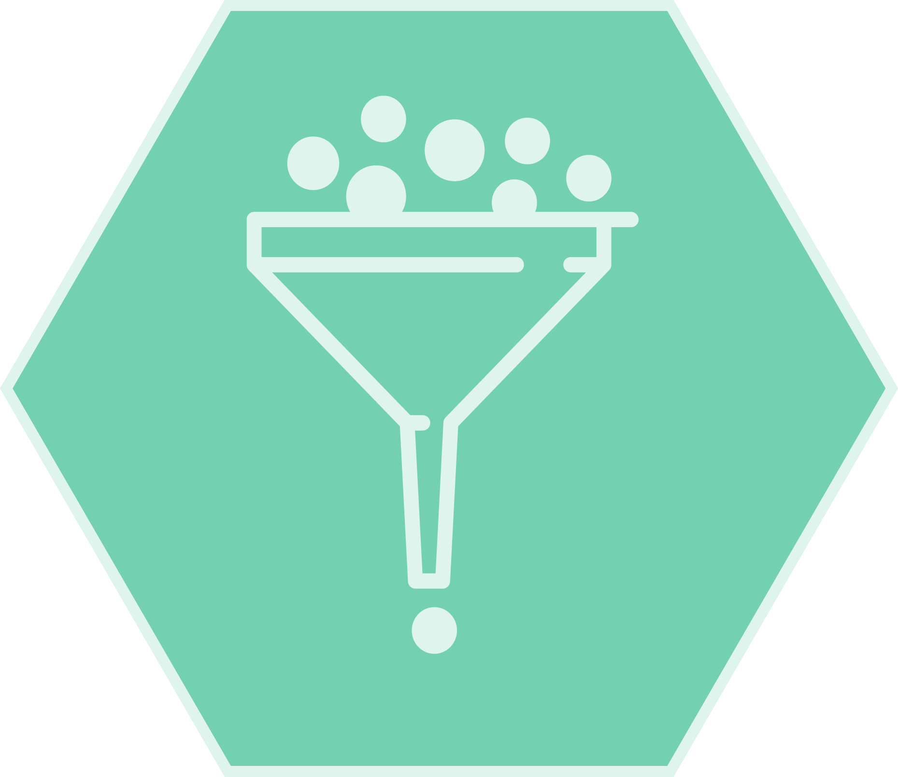

# comBGC: A workflow for parsing, filtering, and merging biosynthetic gene clusters

comBGC is a command-line tool designed to combine, filter, and merge the results from three major BGC prediction tools: deepBGC, GECCO, and antiSMASH. It ensures that only high-quality, non-redundant BGCs are included in the final output.

🔹 Parses results from multiple BGC prediction tools into a unified table  
🔹 Filters BGCs based on quality metrics and removes redundancies  
🔹 Merges overlapping BGCs on the same contig, keeping the largest one  
🔹 Provides a structured and easy-to-interpret final output  

📖 Read the full documentation on our [GitHub Wiki](https://github.com/tomrichtermeier/comBGC-Filter/wiki)
